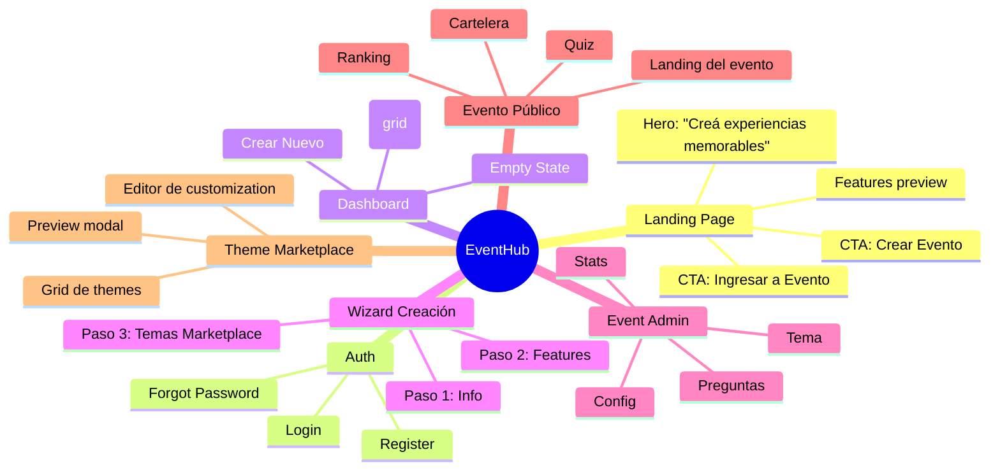

# EventHub - Flujos de Usuario

## 1. Landing Page & Auth Flow

```mermaid
flowchart TD
    START([👤 Visitante]) --> LANDING[🚀 Landing Page<br/>EventHub<br/>"Creá experiencias memorables"]

    LANDING --> OPTIONS{¿Qué querés hacer?}
    OPTIONS -->|Crear evento| AUTH_GUEST[Acceso rápido sin cuenta<br/>o Login/Register]
    OPTIONS -->|Entrar a evento| ENTER_CODE[Ingresá código de evento]

    AUTH_GUEST -->|Sin cuenta| REGISTER[Register<br/>Nombre + Email + Password]
    AUTH_GUEST -->|Ya tengo cuenta| LOGIN[Login<br/>Email + Password]
    REGISTER --> DASHBOARD[📊 Dashboard]
    LOGIN --> DASHBOARD

    ENTER_CODE --> EVENT_SLUG[Ingresá el código<br/>ej: cumple-ana-2026]
    EVENT_SLUG --> VALID{¿Existe?}
    VALID -->|Sí| EVENT_LANDING[🎉 Landing del Evento<br/>Nombre del evento<br/>Fecha<br/>Preview del theme]
    VALID -->|No| ERROR_CODE[❌ Evento no encontrado]
    ERROR_CODE --> ENTER_CODE

    EVENT_LANDING --> EVENT_ACTIONS{¿Qué querés hacer?}
    EVENT_ACTIONS -->|Jugar Quiz| PLAY_QUIZ[📝 Quiz<br/>Solo nombre + avatar]
    EVENT_ACTIONS -->|Ver cartelera| VIEW_CORKBOARD[📸 Cartelera<br/>Postales públicas]
    EVENT_ACTIONS -->|Dejar postal| ADD_POSTCARD[📝 Agregar Postal<br/>Foto + Mensaje]
    PLAY_QUIZ --> QUIZ_COMPLETE[✅ Respuestas enviadas<br/>Ver ranking]
    QUIZ_COMPLETE --> RANKING[🏆 Ranking]
    ADD_POSTCARD --> POSTCARD_ADDED[📬 Postal agregada<br/>Aparece en cartelera]
```

## 2. Wizard de Creación de Evento

```mermaid
flowchart TD
    START([📝 Admin - Nuevo Evento]) --> WELCOME[👋 Bienvenido<br/>"Creá tu evento en minutos"]

    WELCOME --> STEP1[Paso 1: Info Básica]
    STEP1 --> NAME[Nombre del evento<br/>Ej: "Cumpleaños de Ana"]
    STEP1 --> DATE[Fecha del evento]
    STEP1 --> DESC[Descripción<br/>Opcional]
    NAME --> NEXT1[Continuar →]
    DATE --> NEXT1
    DESC --> NEXT1

    NEXT1 --> STEP2[Paso 2: Features]
    STEP2 --> FEATURES{¿Qué features?}
    FEATURES -->|Quiz| QUIZ_TOGGLE[✅ Quiz habilitado<br/>" conocé a la cumpleañera"]
    FEATURES -->|Cartelera| CORK_TOGGLE[✅ Cartelera habilitada<br/>" recibí fotos y mensajes"]
    FEATURES -->|Caja Secreta| SECRET_TOGGLE[☐ Caja Secreta<br/>" sorpresas de ausentes"]
    QUIZ_TOGGLE --> NEXT2[Continuar →]
    CORK_TOGGLE --> NEXT2
    SECRET_TOGGLE --> NEXT2

    NEXT2 --> STEP3[Paso 3: Tema]
    STEP3 --> MARKETPLACE[🎨 Marketplace de Temas]
    MARKETPLACE --> THEMES
    THEMES -->|Princess| THEME_PINK[👸 Princess<br/>Rosa, Great Vibes]
    THEMES -->|Elegant| THEME_PURPLE[💜 Elegant<br/>Púrpura, Playfair]
    THEMES -->|Party| THEME_ORANGE[🎊 Party<br/>Naranja, Fiest|
    THEMES -->|Corporate| THEME_BLUE[💼 Corporate<br/>Azul, Montserrat]
    THEMES -->|Kids| THEME_GREEN[🧒 Kids<br/>Verde, cartoon]
    THEMES -->|Dark| THEME_CYAN[🌙 Dark<br/>Cyan, minimal]
    THEMES -->|Custom| THEME_CUSTOM[✨ Custom<br/>Armá tu propio]

    THEME_PINK -->|Preview| PREVIEW_PINK[Vista previa<br/>del tema Princess]
    THEME_PURPLE -->|Preview| PREVIEW_PURPLE[Vista previa<br/>del tema Elegant]
    THEME_CUSTOM --> CUSTOM_EDITOR[Editor visual<br/>Colores + Fuentes<br/>Logo + Hero image]

    PREVIEW_PINK --> SELECT[Usar este tema]
    PREVIEW_PURPLE --> SELECT
    CUSTOM_EDITOR --> SELECT

    SELECT --> COMPLETE[🎉 ¡Evento creado!]
    COMPLETE --> ADMIN_EVENT[Dashboard del Evento<br/>con tabs]

    CUSTOM_EDITOR --> CUSTOMIZE[Personalizar tema<br/>Colores, fuentes, imágenes]
    CUSTOMIZE --> SELECT
```

## 3. Dashboard del Usuario

```mermaid
flowchart TD
    START([👤 Usuario Logueado]) --> DASHBOARD[📊 Mi Dashboard<br/>EventHub]

    DASHBOARD --> HEADER[Header<br/>Avatar + Email<br/>Logout]
    DASHBOARD --> EMPTY{¿Tiene eventos?}

    EMPTY -->|No| EMPTY_STATE[🎈 No tenés eventos<br/>"Creá tu primer evento"]
    EMPTY_STATE --> CREATE_CTA[Botón: Crear Evento]

    EMPTY -->|Sí| EVENT_LIST[📋 Mis Eventos<br/>Grid de Cards]

    EVENT_LIST --> EVENT_CARD[Card de Evento]
    EVENT_CARD --> CARD_INFO[Nombre + Fecha<br/>Theme preview<br/>Badge: Quiz ⚠️]
    EVENT_CARD --> CARD_ACTIONS[...]
    CARD_ACTIONS -->|Ver| LIVE_EVENT[👁️ Ver evento<br/>Link compartible]
    CARD_ACTIONS -->|Administrar| ADMIN_EVENT[⚙️ Admin del evento]
    CARD_ACTIONS -->|Duplicar| DUPLICATE[📋 Duplicar evento<br/>Como template]

    ADMIN_EVENT --> EVENT_TABS[Tabs de Admin]
    EVENT_TABS --> TAB_CONFIG[📝 Config<br/>Nombre, fecha, features]
    EVENT_TABS --> TAB_QUESTIONS[❓ Preguntas<br/>Solo si Quiz habilitado<br/>⚠️ Badge si vacío]
    EVENT_TABS --> TAB_THEME[🎨 Tema<br/>Cambiar tema<br/>Personalizar]
    EVENT_TABS --> TAB_STATS[📊 Estadísticas<br/>Participantes, fotos]

    TAB_QUESTIONS --> QUIZ_EDITOR[Editor de Preguntas<br/>+ Importar/Exportar]
    TAB_THEME --> THEME_SWITCHER[Cambiar Tema<br/>o Personalizar más]

    CREATE_CTA --> WIZARD[Wizard de Creación]
    WIZARD --> FLOW_WIZARD[flujo anterior]
```

## 4. Admin Panel del Evento

```mermaid
flowchart TD
    START([⚙️ Admin del Evento]) --> EVENT_HEADER[Nombre del Evento<br/>Fecha + Código<br/>Link: themile.game/e/codigo]

    EVENT_HEADER --> TABS{Tabs}
    TABS --> CONFIG[📝 Configuración]
    TABS --> QUESTIONS[❓ Preguntas]
    TABS --> THEME[🎨 Tema]
    TABS --> STATS[📊 Stats]
    TABS --> LIVE[👁️ Ver Evento]

    CONFIG --> CONFIG_FORM
    CONFIG_FORM --> NAME_FIELD[Nombre editable]
    CONFIG_FORM --> DATE_FIELD[Fecha]
    CONFIG_FORM --> FEATURES_TOGGLES[Features on/off<br/>⚠️ Alertas si desactiva<br/>con contenido existente]
    CONFIG_FORM --> SHARE[Copiar link<br/>Compartir WhatsApp]

    QUESTIONS --> QUIZ_LIST[Lista de Preguntas<br/>Drag to reorder]
    QUIZ_LIST --> ADD_QUESTION[+ Agregar<br/>o Importar JSON]
    QUIZ_LIST --> EDIT_QUESTION[✏️ Editar<br/>Respuestas correctas]
    QUIZ_LIST --> DELETE_QUESTION[🗑️ Eliminar]

    THEME --> MARKETPLACE_ADMIN[🎨 Marketplace<br/>6 themes + Custom]
    MARKETPLACE_ADMIN --> SELECT_THEME[Cambiar Theme<br/>Preview antes de aplicar]
    MARKETPLACE_ADMIN --> CUSTOMIZE[Personalizar<br/>Colores + Fuentes]

    STATS --> STATS_CARDS[Cards de métricas]
    STATS_CARDS --> QUIZ_STATS[📝 Quiz<br/>Jugadores: X<br/>Top score: Y]
    STATS_CARDS --> CORK_STATS[📸 Postales<br/>Total: Z<br/>Secretas: W]
    STATS --> LIVE_RANKING[🏆 Ranking en vivo<br/>Top 10]

    LIVE --> PUBLIC_VIEW[👁️ Vista pública<br/>Del evento real]

    QUESTIONS -->|Si no hay preguntas| NO_QUESTIONS[⚠️ "Habilitaste Quiz<br/>pero no hay preguntas"<br/>CTA: Crear Preguntas]
```

## 5. Flujo Completo - Mapa Mental de Vistas


