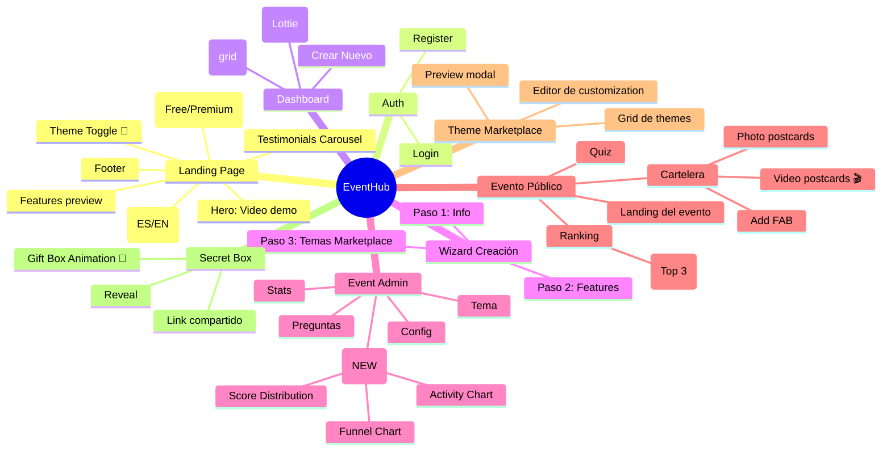

# EventHub - Flujos de Usuario

> Última actualización: 2026-03-20 (Phase 3 Growth & Polish)

## 0. Stack Tecnológico

### Frontend
- React 19 + TypeScript
- Vite 7 (build tool)
- React Router 7 (SPA navigation)
- Tailwind CSS 4
- Framer Motion 12 (animations)
- React Three Fiber + Drei (3D medals)
- Lottie React 2 (animations)
- canvas-confetti (celebrations)
- Zustand 5 (state management)
- react-i18next (ES/EN translations)
- vite-plugin-pwa (PWA support)
- Recharts (analytics charts)

### Backend
- Go 1.23
- Gin (HTTP framework)
- gorilla/websocket (real-time)
- PostgreSQL 15
- Docker Compose

---

## 1. Landing Page & Auth Flow

```mermaid
flowchart TD
    START([👤 Visitante]) --> LANDING[🚀 Landing Page<br/>EventHub<br/>"Creá experiencias memorables"]

    LANDING --> HEADER[Header<br/>Language Switcher (ES/EN)<br/>Theme Toggle 🌙]
    LANDING --> HERO[Hero Section<br/>Video demo (youtube embed)<br/>CTA: Crear Evento<br/>CTA: Ingresar a Evento]
    LANDING --> FEATURES[Features Grid<br/>Quiz • Cartelera • Secret Box]
    LANDING --> DEMO[Demo Video Section<br/>"Mirá cómo funciona"]
    LANDING --> PRICING[Pricing Table<br/>Free vs Premium $4.99]
    LANDING --> TESTIMONIALS[Testimonials Carousel<br/>Social proof]
    LANDING --> FOOTER[Landing Footer<br/>Links • Social • Copyright]

    HERO --> OPTIONS{¿Qué querés hacer?}
    OPTIONS -->|Crear evento| AUTH_GUEST[Acceso rápido sin cuenta<br/>o Login/Register]
    OPTIONS -->|Entrar a evento| ENTER_CODE[Ingresá código de evento]

    AUTH_GUEST -->|Sin cuenta| REGISTER[Register<br/>Nombre + Email + Password]
    AUTH_GUEST -->|Ya tengo cuenta| LOGIN[Login<br/>Email + Password]
    REGISTER --> DASHBOARD[📊 Dashboard]
    LOGIN --> DASHBOARD

    ENTER_CODE --> EVENT_SLUG[Ingresá el código<br/>ej: cumple-ana-2026]
    EVENT_SLUG --> VALID{¿Existe?}
    VALID -->|Sí| EVENT_LANDING[🎉 Landing del Evento<br/>Nombre del evento<br/>Fecha<br/>Preview del theme]
    VALID -->|No| ERROR_CODE[❌ Evento no encontrado]
    ERROR_CODE --> ENTER_CODE

    EVENT_LANDING --> EVENT_ACTIONS{¿Qué querés hacer?}
    EVENT_ACTIONS -->|Jugar Quiz| PLAY_QUIZ[📝 Quiz<br/>Solo nombre + avatar]
    EVENT_ACTIONS -->|Ver cartelera| VIEW_CORKBOARD[📸 Cartelera<br/>Postales + Videos]
    EVENT_ACTIONS -->|Dejar postal| ADD_POSTCARD[📝 Agregar Postal<br/>Foto/Video + Mensaje]
    PLAY_QUIZ --> QUIZ_COMPLETE[✅ Respuestas enviadas<br/>Ver ranking]
    QUIZ_COMPLETE --> RANKING[🏆 Ranking]
    RANKING -->|Top 3| CELEBRATION[🎉 Celebration Animation<br/>Lottie + Confetti<br/>Medal emoji + mensaje]
    RANKING --> VIEW_CORKBOARD
    ADD_POSTCARD --> POSTCARD_ADDED[📬 Postal agregada<br/>Aparece en cartelera]
```

### PWA Support
- Manifest auto-generado con vite-plugin-pwa
- Service Worker (Workbox): cache-first para estáticos, network-first para API
- InstallPromptBanner para instalar en desktop/mobile
- Offline fallback page

### i18n
- react-i18next con ES/EN
- Browser locale detection
- LanguageSwitcher en header
- Traducciones en `public/locales/{es,en}/translation.json`

---

## 2. Wizard de Creación de Evento

```mermaid
flowchart TD
    START([📝 Admin - Nuevo Evento]) --> WELCOME[👋 Bienvenido<br/>"Creá tu evento en minutos"]

    WELCOME --> STEP1[Paso 1: Info Básica]
    STEP1 --> NAME[Nombre del evento<br/>Ej: "Cumpleaños de Ana"]
    STEP1 --> DATE[Fecha del evento]
    STEP1 --> DESC[Descripción<br/>Opcional]
    NAME --> NEXT1[Continuar →]
    DATE --> NEXT1
    DESC --> NEXT1

    NEXT1 --> STEP2[Paso 2: Features]
    STEP2 --> FEATURES{¿Qué features?}
    FEATURES -->|Quiz| QUIZ_TOGGLE[✅ Quiz habilitado<br/>" conocé a la cumpleañera"]
    FEATURES -->|Cartelera| CORK_TOGGLE[✅ Cartelera habilitada<br/>" recibí fotos y mensajes"]
    FEATURES -->|Caja Secreta| SECRET_TOGGLE[☐ Caja Secreta<br/>" sorpresas de ausentes"]
    QUIZ_TOGGLE --> NEXT2[Continuar →]
    CORK_TOGGLE --> NEXT2
    SECRET_TOGGLE --> NEXT2

    NEXT2 --> STEP3[Paso 3: Tema]
    STEP3 --> MARKETPLACE[🎨 Marketplace de Temas]
    MARKETPLACE --> THEMES
    THEMES -->|Princess| THEME_PINK[👸 Princess<br/>Rosa, Great Vibes]
    THEMES -->|Elegant| THEME_PURPLE[💜 Elegant<br/>Púrpura, Playfair]
    THEMES -->|Party| THEME_ORANGE[🎊 Party<br/>Naranja, Fiesta]
    THEMES -->|Corporate| THEME_BLUE[💼 Corporate<br/>Azul, Montserrat]
    THEMES -->|Kids| THEME_GREEN[🧒 Kids<br/>Verde, cartoon]
    THEMES -->|Dark| THEME_CYAN[🌙 Dark<br/>Cyan, minimal]
    THEMES -->|Custom| THEME_CUSTOM[✨ Custom<br/>Armá tu propio]

    THEME_PINK -->|Preview| PREVIEW_PINK[Vista previa<br/>del tema Princess]
    THEME_PURPLE -->|Preview| PREVIEW_PURPLE[Vista previa<br/>del tema Elegant]
    THEME_CUSTOM --> CUSTOM_EDITOR[Editor visual<br/>Colores + Fuentes<br/>Logo + Hero image]

    PREVIEW_PINK --> SELECT[Usar este tema]
    PREVIEW_PURPLE --> SELECT
    CUSTOM_EDITOR --> SELECT

    SELECT --> COMPLETE[🎉 ¡Evento creado!]
    COMPLETE --> ADMIN_EVENT[Dashboard del Evento<br/>con tabs]

    CUSTOM_EDITOR --> CUSTOMIZE[Personalizar tema<br/>Colores, fuentes, imágenes]
    CUSTOMIZE --> SELECT
```

---

## 3. Dashboard del Usuario

```mermaid
flowchart TD
    START([👤 Usuario Logueado]) --> DASHBOARD[📊 Mi Dashboard<br/>EventHub]

    DASHBOARD --> HEADER[Header<br/>Avatar + Email<br/>Logout]
    DASHBOARD --> EMPTY{¿Tiene eventos?}

    EMPTY -->|No| EMPTY_STATE[🎈 Empty State<br/>Lottie Animation<br/>"No tenés eventos aún"]
    EMPTY_STATE --> CREATE_CTA[Botón: Crear Evento]

    EMPTY -->|Sí| EVENT_LIST[📋 Mis Eventos<br/>Grid de Cards]

    EVENT_LIST --> EVENT_CARD[Card de Evento]
    EVENT_CARD --> CARD_INFO[Nombre + Fecha<br/>Theme preview<br/>Badge: Quiz ⚠️]
    EVENT_CARD --> CARD_ACTIONS[...]
    CARD_ACTIONS -->|Ver| LIVE_EVENT[👁️ Ver evento<br/>Link compartible]
    CARD_ACTIONS -->|Administrar| ADMIN_EVENT[⚙️ Admin del evento]
    CARD_ACTIONS -->|Duplicar| DUPLICATE[📋 Duplicar evento<br/>Como template]

    ADMIN_EVENT --> EVENT_TABS[Tabs de Admin]
    EVENT_TABS --> TAB_CONFIG[📝 Config<br/>Nombre, fecha, features]
    EVENT_TABS --> TAB_QUESTIONS[❓ Preguntas<br/>Solo si Quiz habilitado<br/>⚠️ Badge si vacío]
    EVENT_TABS --> TAB_THEME[🎨 Tema<br/>Cambiar tema<br/>Personalizar]
    EVENT_TABS --> TAB_STATS[📊 Stats<br/>Participantes, fotos]
    EVENT_TABS --> TAB_ANALYTICS[📈 Analytics<br/>Timeline • Funnel • Scores]

    TAB_QUESTIONS --> QUIZ_EDITOR[Editor de Preguntas<br/>+ Importar/Exportar]
    TAB_THEME --> THEME_SWITCHER[Cambiar Tema<br/>o Personalizar más]
    TAB_ANALYTICS --> ANALYTICS_DASHBOARD[Dashboard con Recharts<br/>ActivityChart<br/>ScoreDistributionChart<br/>FunnelChart]

    CREATE_CTA --> WIZARD[Wizard de Creación]
    WIZARD --> FLOW_WIZARD[flujo anterior]
```

---

## 4. Admin Panel del Evento

```mermaid
flowchart TD
    START([⚙️ Admin del Evento]) --> EVENT_HEADER[Nombre del Evento<br/>Fecha + Código<br/>Link: themile.game/e/codigo]

    EVENT_HEADER --> TABS{Tabs}
    TABS --> CONFIG[📝 Configuración]
    TABS --> QUESTIONS[❓ Preguntas]
    TABS --> THEME[🎨 Tema]
    TABS --> STATS[📊 Stats]
    TABS --> ANALYTICS[📈 Analytics]
    TABS --> LIVE[👁️ Ver Evento]

    CONFIG --> CONFIG_FORM
    CONFIG_FORM --> NAME_FIELD[Nombre editable]
    CONFIG_FORM --> DATE_FIELD[Fecha]
    CONFIG_FORM --> FEATURES_TOGGLES[Features on/off<br/>⚠️ Alertas si desactiva<br/>con contenido existente]
    CONFIG_FORM --> SHARE[Copiar link<br/>Compartir WhatsApp]

    QUESTIONS --> QUIZ_LIST[Lista de Preguntas<br/>Drag to reorder]
    QUIZ_LIST --> ADD_QUESTION[+ Agregar<br/>o Importar JSON]
    QUIZ_LIST --> EDIT_QUESTION[✏️ Editar<br/>Respuestas correctas]
    QUIZ_LIST --> DELETE_QUESTION[🗑️ Eliminar]

    THEME --> MARKETPLACE_ADMIN[🎨 Marketplace<br/>6 themes + Custom]
    MARKETPLACE_ADMIN --> SELECT_THEME[Cambiar Theme<br/>Preview antes de aplicar]
    MARKETPLACE_ADMIN --> CUSTOMIZE[Personalizar<br/>Colores + Fuentes]

    STATS --> STATS_CARDS[Cards de métricas]
    STATS_CARDS --> QUIZ_STATS[📝 Quiz<br/>Jugadores: X<br/>Top score: Y]
    STATS_CARDS --> CORK_STATS[📸 Postales<br/>Total: Z<br/>Secretas: W]
    STATS --> LIVE_RANKING[🏆 Ranking en vivo<br/>Top 10]

    ANALYTICS --> ANALYTICS_CHARTS[Gráficos con Recharts]
    ANALYTICS --> TIMELINE[📅 Activity Timeline<br/>Page views por hora/día]
    ANALYTICS --> FUNNEL[🔽 Conversion Funnel<br/>Visitantes → Jugadores → Completan]
    ANALYTICS --> SCORES[📊 Score Distribution<br/>Histograma de puntajes]
    ANALYTICS --> SUMMARY[📋 Summary Cards<br/>Total views, jugadores, postales]

    LIVE --> PUBLIC_VIEW[👁️ Vista pública<br/>Del evento real]

    QUESTIONS -->|Si no hay preguntas| NO_QUESTIONS[⚠️ "Habilitaste Quiz<br/>pero no hay preguntas"<br/>CTA: Crear Preguntas]
```

### Analytics API Endpoints

```
GET /api/admin/events/:slug/analytics          # Summary stats
GET /api/admin/events/:slug/analytics/timeline # Activity by hour/day
GET /api/admin/events/:slug/analytics/funnel   # Conversion funnel
GET /api/admin/events/:slug/analytics/scores   # Score distribution
POST /api/events/:slug/page-view                # Track page view
```

---

## 5. Quiz Flow (Player-Facing)

```mermaid
flowchart TD
    START([👤 Jugador]) --> EVENT_LANDING[🎉 Landing del Evento<br/>Nombre + Theme<br/>Botón: Empezar Juego]

    EVENT_LANDING --> REGISTER[📝 Registro<br/>Nombre + Avatar]
    REGISTER --> QUIZ[📝 Quiz<br/>Preguntas configuradas<br/>por el admin]

    QUIZ --> QUESTION_TYPES{Tipo de Pregunta}
    QUESTION_TYPES -->|Texto libre| TEXT_INPUT[Input de texto<br/>Comparación fuzzy]
    QUESTION_TYPES -->|Opción múltiple| MULTIPLE_CHOICE[Selector de opción<br/>Match exacto]
    QUESTION_TYPES -->|This or That| A_B_CHOICE[A vs B Selector<br/>Match exacto]

    QUIZ --> SUBMIT[Enviar Respuestas]
    SUBMIT --> SCORING[Backend: normaliza + scoring]
    SCORING --> THANK_YOU[✅ Gracias<br/>"Gracias por participar!"]
    THANK_YOU --> RANKING[🏆 Ranking<br/>Ver posición]

    RANKING -->|Top 3| CELEBRATION[🎉 Celebration Modal<br/>🥇🥈🥉 Lottie + Confetti<br/>Tu posición + nombre]
    CELEBRATION --> VIEW_CORKBOARD
    RANKING --> VIEW_CORKBOARD
```

### Scoring System

```
score = normalized_similarity(user_answer, correct_answer)  // 0.0 - 1.0
```

Para opción múltiple y A/B: score binario (0 o 1).

---

## 6. Cartelera de Corcho & Video Postcards

```mermaid
flowchart TD
    START([👤 Visitante]) --> CORKBOARD[📸 Cartelera de Corcho<br/>Texture background<br/>Stamps decorativas]

    CORKBOARD --> POSTCARDS{¿Hay postales?}
    POSTCARDS -->|No| EMPTY_CORK[Empty State<br/>Lottie Animation<br/>"Sé el primero"]

    POSTCARDS -->|Sí| POSTCARD_GRID[Grid de Postales<br/>Rotación random<br/>Pin decorativo]
    POSTCARD_GRID --> POSTCARD_TYPES{Tipo}
    POSTCARD_TYPES -->|Imagen| IMAGE_POSTCARD[📷 Imagen<br/>Play button: none]
    POSTCARD_TYPES -->|Video| VIDEO_POSTCARD[🎬 Video<br/>Play button visible<br/>Duration badge<br/>Thumbnail + HTML5 player]

    POSTCARD_GRID -->|Tap/Click| POSTCARD_MODAL[Modal Fullscreen<br/>Media player<br/>Mensaje + Remitente]
    POSTCARD_MODAL --> DOWNLOAD[Descargar PNG<br/>html-to-image]

    CORKBOARD --> ADD_FAB[+ Agregar Postal<br/>FAB button]
    ADD_FAB --> ADD_SHEET[Bottom Sheet<br/>Photo/Video toggle]
    ADD_SHEET --> PHOTO_MODE[📷 Foto<br/>Cámara frontal<br/>Preview + Mensaje]
    ADD_SHEET --> VIDEO_MODE[🎬 Video<br/>MediaRecorder API<br/>Max 30 segundos<br/>Timer visual]

    PHOTO_MODE --> UPLOAD_IMAGE[Upload imagen<br/>JPEG/PNG/WebP<br/>Max 10MB]
    VIDEO_MODE --> UPLOAD_VIDEO[Upload video<br/>MP4/WebM/MOV<br/>Max 50MB<br/>ffmpeg thumbnail]

    UPLOAD_IMAGE --> POSTCARD_CREATED[📬 Postal creada<br/>Broadcast WebSocket]
    UPLOAD_VIDEO --> POSTCARD_CREATED
```

### Backend Video Processing

1. Recibe media → valida por magic bytes (MP4, WebM, M4V)
2. Guarda en disco (`videos/` o `postcards/`)
3. Si es video: `ffmpeg` genera thumbnail @ 1s, `ffprobe` extrae duración
4. Guarda en DB: `media_type`, `thumbnail_path`, `media_duration_ms`

---

## 7. Secret Box - Sorpresa para Festejado

```mermaid
flowchart TD
    START([👤 Ausente]) --> SECRET_LINK[🔗 Link secreto<br/>WhatsApp/Email<br/>?token=TOKEN]

    SECRET_LINK --> SECRET_PAGE[🎁 Secret Box<br/>"Dejá tu sorpresa<br/>para [nombre]"]
    SECRET_PAGE --> SECRET_FORM[Formulario<br/>Tu nombre<br/>Foto o Video<br/>Mensaje]
    SECRET_FORM --> SECRET_SUBMIT[Enviar<br/>X-Secret-Token header]
    SECRET_SUBMIT --> SECRET_CREATED[✅ Sorpresa guardada<br/>No aparece en cartelera<br/>hasta reveal]

    SECRET_CREATED --> ADMIN_PANEL[⚙️ Admin Panel<br/>Tab Stats<br/>Ver postcards secretas]

    ADMIN_PANEL --> REVEAL_BUTTON[🔓 Botón: Revelar<br/>"Momento sorpresa"]
    REVEAL_BUTTON --> CONFIRM[Confirmar<br/>⚠️ Irreversible]

    CONFIRM --> REVEAL_BROADCAST[📡 WebSocket<br/>secret_box_reveal<br/>a todos los Corkboards]

    REVEAL_BROADCAST --> GIFT_BOX_ANIM[GiftBox Animation<br/>Scale up + Wobble<br/>Open + Fly-out<br/>Confetti]

    GIFT_BOX_ANIM --> POSTCARDS_PINNED[📌 Postales pineadas<br/>en el corcho<br/>Auto-open primera]
```

### Gift Box Animation Sequence

1. Gift Box aparece — scale 0→1 con spring
2. Wobble — rotate ±5° × 2-3 veces
3. Apertura — tapa vuela hacia arriba
4. Postcards fly-out — stagger 320ms entre cada una
5. Confetti burst
6. Gift Box desaparece
7. Auto-open primera postal en modal

---

## 8. Flujo Completo - Mapa Mental de Vistas



---

## 9. API Endpoints - Resumen

### Authentication
```
POST /api/auth/register
POST /api/auth/login
POST /api/auth/refresh
GET  /api/auth/me
POST /api/auth/logout
```

### Events
```
GET  /api/users/me/events
POST /api/events
GET  /api/events/:id
GET  /api/events/by-slug/:slug
PUT  /api/events/:id
DELETE /api/events/:id
GET  /api/themes/presets
```

### Quiz & Players
```
POST /api/events/:slug/players
GET  /api/events/:slug/players/:id
GET  /api/events/:slug/players
POST /api/events/:slug/quiz/submit
GET  /api/events/:slug/quiz/answers/:player_id
GET  /api/events/:slug/quiz/questions
GET  /api/events/:slug/ranking
```

### Postcards (con Video Support)
```
POST /api/postcards           # multipart: image OR media + message
                              # Returns: id, image_path, media_type, 
                              #          thumbnail_path, media_duration_ms
GET  /api/postcards           # ?event_id=
POST /api/postcards/secret    # X-Secret-Token: TOKEN
```

### Admin Secret Box
```
GET  /api/events/:slug/admin/secret-box
POST /api/events/:slug/admin/reveal
GET  /api/events/:slug/admin/secret-box/status
```

### Analytics (NEW)
```
GET  /api/admin/events/:slug/analytics
GET  /api/admin/events/:slug/analytics/timeline
GET  /api/admin/events/:slug/analytics/funnel
GET  /api/admin/events/:slug/analytics/scores
POST /api/events/:slug/page-view
```

### Real-time
```
WS /ws  # WebSocket: ranking updates, new postcards, secret_box_reveal
```

---

## 10. Base de Datos - Migraciones

### Migration 006: Video Postcards
```sql
ALTER TABLE postcards ADD COLUMN media_type VARCHAR(20);
ALTER TABLE postcards ADD COLUMN thumbnail_path VARCHAR(500);
ALTER TABLE postcards ADD COLUMN media_duration_ms INTEGER;
ALTER TABLE postcards ADD COLUMN rotation DECIMAL(4,2) DEFAULT 0;
```

### Migration 007: Analytics
```sql
CREATE TABLE page_views (
    id SERIAL PRIMARY KEY,
    event_id UUID REFERENCES events(id),
    viewed_at TIMESTAMP DEFAULT NOW(),
    path VARCHAR(255),
    user_agent TEXT
);

CREATE TABLE quiz_events (
    id SERIAL PRIMARY KEY,
    event_id UUID REFERENCES events(id),
    player_id UUID,
    event_type VARCHAR(50),
    occurred_at TIMESTAMP DEFAULT NOW()
);

CREATE TABLE postcard_events (
    id SERIAL PRIMARY KEY,
    event_id UUID REFERENCES events(id),
    postcard_id UUID REFERENCES postcards(id),
    event_type VARCHAR(50),
    occurred_at TIMESTAMP DEFAULT NOW()
);
```

---

## 11. Testing

| Tipo | Herramienta | Estado |
|------|------------|--------|
| Unit Backend | Go testing | ✅ 100% coverage |
| Unit Frontend | Vitest | ✅ Implementado |
| E2E | Playwright | ✅ 35/38 passing |

---

## 12. Docker Services

```bash
docker compose up -d

# Services:
# - postgres: Database (port 5432)
# - backend: Go API (port 8080)
# - frontend: Nginx serve (port 8082)
```
